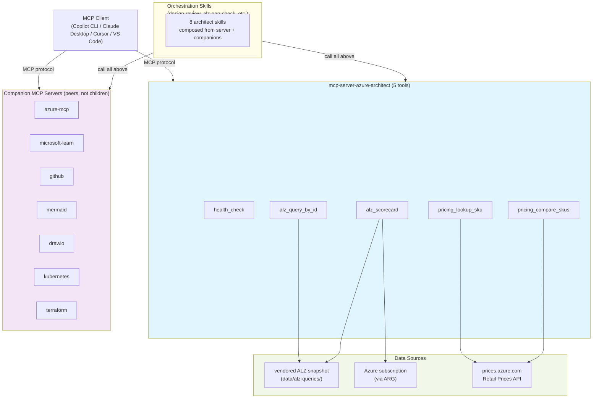

# mcp-server-azure-architect

> **Not an official Microsoft product.** This is a personal community tool that **complements** the official Microsoft [`azure-mcp`](https://github.com/microsoft/azure-mcp) server, it does not replace it.

MCP server and Copilot CLI skills bundle for Azure architects. Native tools fill the architect-shaped gap above `azure-mcp`: named ALZ checklist queries by ID, ALZ readiness scorecard, pricing lookup and comparison. Curated companion kit (Microsoft Learn, mermaid, Terraform, Kubernetes, etc.) bundles with one install.

## Why this exists

`azure-mcp` already exposes Azure Resource Graph, Advisor, Monitor, Policy, RBAC, AKS, and more as MCP tools. Use it directly for those.

What architects still need that `azure-mcp` does **not** ship:

- **Named ALZ checklist queries.** Look up by checklist ID (not raw KQL), get the query, source attribution, and pillar classification.
- **ALZ readiness scorecard.** Run vendored ALZ queries against a subscription, get pass/fail/unknown per item plus aggregate by pillar.
- **Azure pricing tools.** Look up retail pricing by SKU and region, compare SKU costs side by side.
- **Architect orchestration skills.** A `design-review` skill that pulls current state via `azure-mcp`, gaps via this server, and renders diagrams via `mermaid-mcp`. Similar skills for migration planning and policy review.

This server is **not a router or aggregator.** MCP clients already aggregate. We ship the missing tools and a curated companion config.

## Native tools (5)

| Tool | Purpose |
|------|---------|
| `health_check` | Check server health and version. One-line status response. |
| `alz_query_by_id` | Vendored ALZ checklist query lookup by ID. Returns KQL text, source commit, and citation. Read-only snapshot scan, no Azure calls. |
| `pricing_lookup_sku` | Azure retail pricing for one SKU in one region, one term. Calls public Retail Prices API (no auth). 24-hour cache. |
| `pricing_compare_skus` | Compare retail pricing for multiple SKUs side by side. Useful for sizing trade-off review. Capped at 10 SKUs per call. |
| `alz_scorecard` | Run vendored ALZ queries against a subscription via Azure Resource Graph. Returns per-item pass/fail/unknown plus aggregate by pillar. Capped at 25 queries per call. |

All tools are read-only. See [ADR-003](docs/adr/0003-read-only-enforcement.md) for enforcement details.

## Skills (8)

Orchestration skills layer above the server and companion kit:

| Skill | Purpose |
|-------|---------|
| `design-review` | Comprehensive Well-Architected review. Pulls current state, runs scorecard, highlights gaps, renders diagram. |
| `alz-gap-check` | ALZ readiness mini-audit. Maps checklist items to resources found. Reports high-impact gaps. |
| `ingress-migration-plan` | Kubernetes ingress migration planner. Current state via kubernetes-mcp, plan via orchestration. |
| `policy-as-code-suggest` | Draft Azure Policy rules from unmet checklist items. Compliance-as-code pattern. |
| `alz-vendoring` | Refresh ALZ query snapshot from upstream. Vendor management skill (internal). |
| `fastmcp-bootstrap` | FastMCP new-tool scaffolding. Training skill. |
| `mcp-runtime-evaluation` | Evaluate runtime choices for new tools. Training skill. |
| `stride-lite-mcp-readonly` | Threat model for read-only tools. Training skill. |

Each skill links to a `.squad/skills/*/SKILL.md` reference. See [docs/skills](docs/skills) for user-facing catalogs.

## What's in scope and out of scope

**In scope:**
- Native MCP tools for ALZ checklist queries, scoring, and pricing lookup.
- Read-only architect orchestration skills (design review, gap analysis, migration planning, policy drafting).
- Curated companion kit via `mcp-config.json`.
- DefaultAzureCredential auth, no mutation tools.

**Out of scope:**
- Wrapping or proxying `azure-mcp`. Anything `azure-mcp` already exposes (raw KQL, Advisor, Monitor, Policy, RBAC, AKS, App Service) is **explicitly out**.
- Mutation tools (create/update/delete on Azure). Read-only stays read-only.
- Hosted multi-tenant deployment. Local-first only.

## Architecture



## Status

Pre-alpha. Backlog tracked as GitHub issues with the `squad` label. Runtime, vendoring policy, read-only enforcement, and companion selection ratified via ADRs. See [docs/adr](docs/adr) for decisions.

## Stack

Python 3.11+ with FastMCP, per [ADR-001](docs/adr/0001-runtime-choice.md). Build via Hatchling, lint with ruff, types with mypy, tests with pytest. Distribution via `uvx mcp-server-azure-architect` (end users); dev install via `uv pip install -e .`.

**Note:** Package publication is forthcoming. When v0.1.0 publishes to PyPI, `uvx mcp-server-azure-architect` will be the canonical path. For now, use dev install or the install script (see Quickstart).

**Constraints:**
- Local-first, single process. Cold-start under 1 second on Python 3.12 (per ADR-001 measurements).
- Read-only Azure SDK calls only. DefaultAzureCredential exclusively. See [ADR-003](docs/adr/0003-read-only-enforcement.md).
- Zero credentials at rest. Token-scrub on any logging.
- ALZ queries from `martinopedal/alz-checklist-queries` and `martinopedal/alz-graph-queries` (vendored snapshot, pinned by commit SHA). See [ADR-002](docs/adr/0002-alz-query-vendoring-policy.md).
- Companion servers do not proxy `azure-mcp`. See [ADR-004](docs/adr/0004-companion-server-bar.md).

## Quickstart

### Install

**Recommended for local development:**

```bash
python scripts/install_kit.py
```

This script installs the server, dev dependencies, and companion kit in one step. (Landing in PR #16; use editable install below until then.)

**Editable install (alternative for now):**

```bash
pip install uv
uv pip install -e ".[dev]"
```

**End users (when v0.1.0 publishes):**

```bash
uvx mcp-server-azure-architect
```

### Run

Start the server via stdio:

```bash
mcp-server-azure-architect
```

Test with MCP Inspector:

```bash
npx @modelcontextprotocol/inspector mcp-server-azure-architect
```

### Configure

Add to your MCP client config (e.g., `~/.config/claude/mcp.json` for Claude Desktop or `~/.cursor/mcp.json` for Cursor):

```json
{
  "mcpServers": {
    "mcp-server-azure-architect": {
      "command": "uvx",
      "args": ["mcp-server-azure-architect"]
    }
  }
}
```

Or use the curated `mcp-config.json` shipped with this repo as a template.

### Authentication

The server uses `DefaultAzureCredential` from the Azure SDK. It tries credentials in this order:

1. Environment variables (`AZURE_CLIENT_ID`, `AZURE_TENANT_ID`, `AZURE_CLIENT_SECRET`)
2. Managed Identity (when running on Azure compute)
3. Azure CLI (`az login`)

All tools are read-only. No Azure write operations are exposed.

## Development

### Run Smoke Tests

Before pushing changes or as part of local validation, run the MCP smoke test to verify tool registration, JSON Schema validity, and basic invocability:

```bash
python scripts/mcp_smoke.py
```

This test validates that:
- All expected tools are registered (health_check, alz_query_by_id, pricing_lookup_sku, pricing_compare_skus, alz_scorecard)
- Every tool has a valid JSON Schema for its inputs
- The health_check tool can be invoked successfully

The smoke test does NOT call Azure, it only exercises the MCP protocol layer. Typical runtime is around 13 seconds.

### Run Tests

```bash
python -m pytest -q
```

### Linting and Type Checking

```bash
python -m ruff check .
python -m mypy src tests scripts
```

## Squad and Contributions

Multi-agent dev via [Squad by Brady Gaster](https://github.com/bradygaster/squad). Team roles in [`.squad/team.md`](.squad/team.md). Routing rules in [`.squad/routing.md`](.squad/routing.md). Open `squad`-labeled issues are the live backlog. Non-authors must have at least one reviewer sign-off before merge.

## References and further reading

- **Decision records:** See [`docs/adr/`](docs/adr/) for architecture decisions on runtime choice, ALZ query vendoring, read-only enforcement, and companion selection.
- **Skills catalog:** See [`docs/skills/`](docs/skills) (under development; interim reference is `.squad/skills/*/SKILL.md`).
- **Threat model:** See [`SECURITY.md`](SECURITY.md) for read-only threat model and security guidelines.
- **Vendoring manifest:** See [`data/alz-queries/MANIFEST.md`](data/alz-queries/MANIFEST.md) for ALZ query source attribution and refresh policy.
- **Contributing:** See [`CONTRIBUTING.md`](CONTRIBUTING.md) for development workflows and code review expectations.

## License

MIT.
