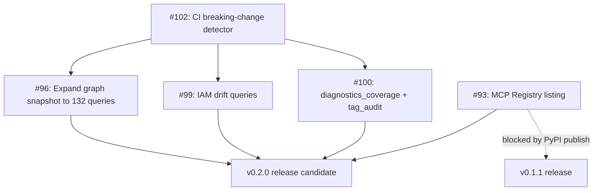

# v0.2: Catalogue Expansion + Tooling

> **Status:** Planning. Scope is committed; sequencing and effort estimates are guidance, not contracts.

## Goal

v0.2 delivers the queryable catalogue depth that justifies the server's existence. Wave 9 research confirmed the server currently ships 4 of 305 queryable ALZ items (1.3% coverage). The graph upstream carries 132 MIT-licensed, queryable, well-documented queries that are locked behind a broken refresh script. v0.2 unlocks them via vendored snapshot expansion, ships CI gates to guard against breaking drift, and closes the identity / RBAC coverage gap (the thinnest upstream pillar). This is MCP-server work only per Martin's scope filter. Skill orchestration (#11, #13, #14) is deferred pending separate evaluation.

## Scope (In)

### Vendored Catalogue Expansion

The north star for v0.2. Architect value scales with query depth.

- **#96:** `feat(alz): expand vendored graph snapshot to all 132 queryable items` (Atlas, M effort)
  - **MCP-shape rationale:** Expands data behind existing `alz_query_by_id` and `alz_query_list` tools. Graph repo is MIT-licensed, queryable-flagged, carries `queryIntent` + `description` fields checklist repo lacks. Broken refresh script (fixed in Wave 9 via #89) now unblocks bulk vendor.
  - **Depends on:** Nothing (refresh script fixed in v0.1.1).
  - **Acceptance:** Vendored snapshot covers ≥90% of upstream queryable=true items (118+ of 132). `alz_query_list` surfaces `queryIntent` and `description`. SHA-256 hashes regenerated. CHANGELOG entry under [Unreleased].

- **#99:** `feat(alz): identity / RBAC drift queries (custom roles, classic admins, orphan MIs)` (Atlas, M effort)
  - **MCP-shape rationale:** Fills thinnest upstream pillar (1 graph + 13 checklist IAM items). Queries ship as vendored `.kql` under `data/alz-queries/native/` per Atlas escape-valve pattern. Surfaced via `alz_query_by_id`, consumable by `alz_scorecard`. Per ADR-002, native queries acceptable when upstream coverage is sparse and queries cite provenance.
  - **Depends on:** Nothing (can run parallel to #96).
  - **Acceptance:** 3+ IAM drift queries vendored (custom roles, classic admins, orphan managed identities). Manifest updated with provenance citations. `alz_scorecard` can run them.

- **#100:** `feat(alz): diagnostics_coverage and tag_audit vendored queries` (Atlas, S effort)
  - **MCP-shape rationale:** Two single-ARG-call queries. Native tools not warranted per ADR-004 (narrow scope, no compose logic). Ship as checklist-shaped queries surfaced through `alz_query_by_id` and composable into `alz_scorecard`.
  - **Depends on:** Nothing.
  - **Acceptance:** 2 queries vendored, manifest updated, tool smoke tests pass.

### Tooling and CI

Guards catalogue expansion and prevents regression.

- **#102:** `chore(ci): breaking-change detector on refresh PRs` (Atlas, S effort)
  - **MCP-shape rationale:** Stdlib-only CI gate. Parses vendored `.kql`, flags if first table-reference token changes (e.g., `resources` → `authorizationresources` is a breaking schema shift). Prevents silent breaking drift in auto-refresh workflow. Defends MCP tool stability.
  - **Depends on:** Nothing. Should land **before** bulk vendor expansions (#96, #99, #100) so detector exists when those PRs land.
  - **Acceptance:** CI workflow added, integration test with synthetic breaking KQL passes, documented in `data/alz-queries/CONTRIBUTING.md`.

### Distribution

Unblocks external discovery of the server.

- **#93:** `chore(release): list v0.1.1 in MCP Registry` (Sage, S effort, **BLOCKED** on Martin's PyPI trusted-publisher setup)
  - **MCP-shape rationale:** MCP Registry is the canonical MCP server discovery mechanism post-Anthropic catalogue consolidation. Without listing, server is invisible to adopters not already in this repo. Pure distribution work, no tool changes.
  - **Depends on:** v0.1.1 PyPI publish (not in Squad control).
  - **Acceptance:** Server listed at [registry.modelcontextprotocol.io](https://registry.modelcontextprotocol.io/) with correct metadata (description, tags, install command, repo link).

## Out of Scope

Explicitly deferred or rejected for v0.2:

- **Skill work:** Three deferred skill issues (N9: `design-review`, N15: `quota-and-region-readiness`, N16: `waf-pillar-walkthrough` from Wave 9 synthesis). These are Copilot CLI skill orchestration, not MCP server tool surface. Per Martin's MCP scope filter (`.squad/decisions/inbox/copilot-directive-mcp-scope-filter.md`), skills will be re-evaluated separately as a skill bundle outside the MCP server release cycle.

- **Duplication of `microsoft/mcp` namespaces:** Quota planner and Advisor surfacing removed from AGENTS.md mission per #91 (closed in Wave 9). `microsoft/mcp` (formerly `Azure/azure-mcp`) covers quota, advisor, monitor, policy, RBAC, and 40+ other Azure namespaces. Per ADR-004 criterion 4, we do not duplicate. We compose via skills or rely on companion kit.

- **Performance work:** #67 (lazy-import azure.identity) and #68 (lazy-import httpx) both CLOSED in Wave 9. No open perf items remain for v0.2.

- **Hardening items already shipped:** All Wave 9 threat-model items closed (#57, #58, #59, #60, #61, #62, #63). Subscription scope validation (S1), audit logging (R1), log permissions (I3), sensitive-data warnings (I2), pagination + timeouts (D1), and SHA-256 integrity checks (T1) all shipped in [Unreleased] per CHANGELOG.

- **New native Azure read tools beyond vendored queries:** Per ADR-004 and Wave 9 research, the gap above azure-mcp is not "more Azure tools." It is query catalogue depth and architect workflow composition (skills). New native tools only warranted when: (a) upstream has no query, (b) surface is composition-heavy (e.g., `pricing_estimate_workload`), (c) does not duplicate azure-mcp.

## Sequencing

**Recommended wave order:**

- **Wave A (CI foundation):** #102 first. Lands the breaking-change detector so it guards all subsequent vendoring work.
- **Wave B (parallel catalogue expansion):** #96, #99, #100 in parallel. All are Atlas-owned, data-only, no cross-dependencies. Atlas can fan out or sequence per capacity.
- **Wave C (distribution):** #93 once PyPI publish completes (external dependency, Martin-gated). Sage owns submission.

## Acceptance Criteria for v0.2 Release

When are we done?

- All in-scope issues (#96, #99, #100, #102) closed.
- #93 closed **or** documented as deferred to v0.2.1 if PyPI publish remains blocked.
- Vendored snapshot covers ≥90% of upstream `martinopedal/alz-graph-queries` queryable items (118+ of 132).
- CI breaking-change detector is gating refresh PRs (integration test passes).
- `THIRD-PARTY-NOTICES` and license metadata in place per #95 (carries from v0.1.2).
- CHANGELOG entry per item under `[Unreleased]`, moved to `[v0.2.0]` at tag time.
- No regressions: all validation gates pass (ruff, mypy, pytest 3.11/3.12, MCP Inspector smoke, readonly AST gate, gitleaks, CodeQL, dependency-review).
- ADR update if architectural decisions touched (none anticipated; all v0.2 work is data expansion under existing ADR-002 vendoring policy).

## Related Decisions

- **ADR-001:** MCP Server Runtime Choice (Python + FastMCP). Foundation for all tool work.
- **ADR-002:** ALZ Query Vendoring Policy. Governs snapshot layout, manifest structure, upstream citation requirements. All catalogue expansion follows this.
- **ADR-003:** Read-Only Enforcement Mechanism. AST-based import allowlist. Guards mutation surface. No v0.2 changes anticipated.
- **ADR-004:** Companion Server Selection Bar (with Wave 9 addendum PR #108). Criterion 4 now explicitly excludes Quota and Cost Management duplication. Reaffirms complement-not-wrap posture. Skill work deferred per this ADR.
- **ADR-005:** SemVer Policy. v0.2.0 is a minor bump (new queries = new tool output). No breaking changes unless #94 (pillar→source rename) slips from v0.1.2 to v0.2 (would require v0.2.0 → v0.3.0 re-tier per semver).

**Proposed ADRs (not filed yet):**

- None for v0.2. All work falls under existing ADR-002 vendoring policy and ADR-004 companion bar. If a new architectural question surfaces during execution (e.g., how to version-pin graph queries beyond commit SHA), Atlas will file a decision proposal.

## Open Questions

1. **#94 v0.1.2 vs v0.2 timing:** Issue #94 (pillar→source rename) is currently scoped v0.1.2. If v0.1.2 slips, does it land in v0.2 **before** #96 (so new queries never see the old `pillar` field name), or does it defer to v0.3 (accepting one more release with the misnomer)? Preference: land in v0.1.2 as planned to avoid churn.

2. **Graph query versioning strategy:** Upstream `martinopedal/alz-graph-queries` pins to commit SHA today. Should v0.2 snapshot introduce a `queryVersion` field per item (e.g., `v1.1.0+8a3fdda`) or continue commit-SHA-only? Atlas to decide during #96 execution. Affects manifest schema.

3. **Native IAM query provenance format:** #99 ships native queries under `data/alz-queries/native/`. What citation header format? Suggest: KQL comment block with `-- Provenance:`, `-- Author:`, `-- License:`, `-- Upstream:` fields. Atlas owns pattern; Sentinel reviews for license hygiene.
